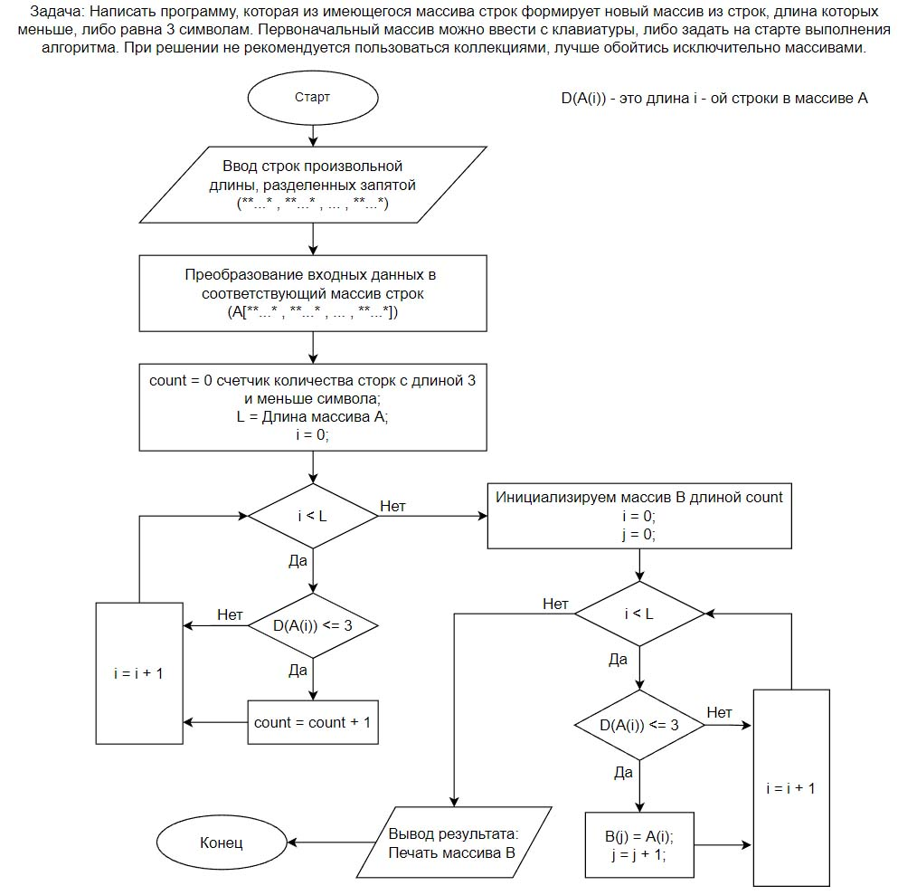

# Задача: Нарисовать блок-схему алгоритма.
## Из массива строк формируется новый массив из строк, длина которых меньше, либо равна 3 символам. 
### При решении не рекомендуется пользоваться коллекциями, лучше обойтись исключительно массивами.
* А - исходный массив строк.
* В - новый формируемый по условию задачи массив строк.
* i - индексы исходного массива А.
* j - индексы создаваемого массива В.

Остальные элементы алгоритма описанны на блок-схеме.
